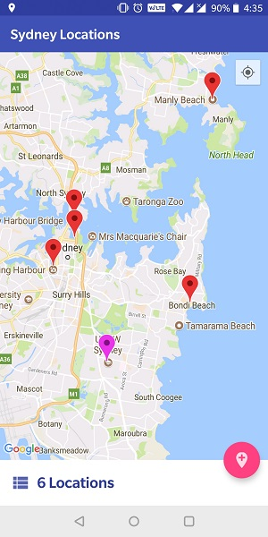

# Locations App
An android app to show locations of common places in Sydney. Users can view default locations and add custom locations as well. All the locations are persisted locally. This app has been written in Kotlin.

## Screenshots

         

## How to run the app

### Project Setup

* Download or clone the repository from `https://github.com/fahadmoinuddin/LocationsApp.git`.
* Open the project in Android Studio (3.0 and higher).
* Download and install the dependencies to complete the build process.
* Once the projects builds without dependency errors, you are now ready to run the app on a device or emulator.

### Running the app on a Real device

1. Connect the mobile device to the system.
2. Turn on *Developer Options* and *USB Debugging* in the device. You can find these options in the Settings menu. If Developer Options is not available, go to *About Phone* option and click on *Build Number* 7 times (Different devices have different steps to enable Developer options. However, the steps will be similar to the above).
3. Click *Run -> Run 'app'* in Android Studio.
4. A window appears. You should see your device in the window. Select the device and click ok.
5. Wait for the gradle build to complete. Once done, the app will be installed in the device.

### Running the app on an Emulator

1. Click *Tools -> AVD Manager* in Android Studio.
2. A window appears. Click *Create Virtual Device*.
3. Choose a device.
4. Choose a System image. (If no images are available, download from *SDK Manager*)
5. Enter a name for the device and click Finish.
6. Repeat steps 3 - 5 from the steps given in *Running the app on a Real device*

## Assumptions

* This app will run on devices with minimum SDK version \>= 15.
* Default locations are imported from the JSON files on first launch of the app and stored locally.
* The marker is placed on the user's current location when the user clicks on add location feature. If the current location is not known, the marker is placed in Sydney.
* Address text is also stored as part of the location.
* Notes can be optionally added/edited for every location. Default notes is of the form 'Notes: \<Location name\>'.
* Default locations are denoted with a star icon in list view and detailed view to avoid confusion.
* Default locations are shown as Red colored markers and custom locations are shown as Magenta colored markers in the map.
